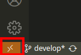
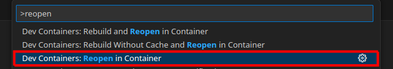
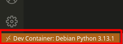
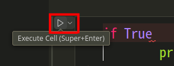
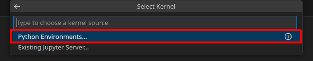
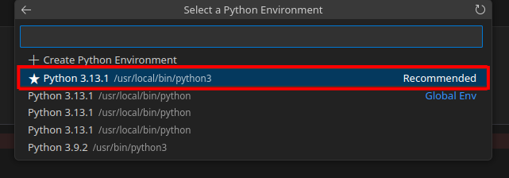
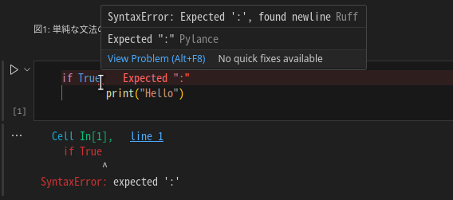

# Software Design 2025年2月号 第1特集「可読性、保守性にすぐれた Pythonコードの書き方 2025」

## 第3章: 例外処理とロギング サンプルコード

本リポジトリは、[Software Design 2025年2月号](https://gihyo.jp/magazine/SD)
第1特集「可読性、保守性にすぐれた Pythonコードの書き方 2025」第3章: 例外処理とロギングのサンプルコードです。

なお、本誌ではサンプルコードの実行にPythonのREPLを使用していますが、本リポジトリのサンプルコードはNotebook実行環境で動作します。そのため、実行環境の違いにより出力や挙動が若干異なる場合があります。

## ディレクトリ構成

```console
$ tree
├── .devcontainer/ # Dev Containerの実行に必要なファイルが含まれます。
│   ├── Dockerfile
│   └── devcontainer.json
├── 03_exception_handling/ # サンプルコードのJupyter Notebookファイル（*.ipynb）・Pythonファイル（*.py）が含まれます。
│   ├── config.py
│   ├── section1.ipynb
│   ├── section2.ipynb
│   ...
├── images/ # README.mdの画像が含まれます。
├── .gitignore # Gitの追跡対象設定ファイルです。
└── README.md # このREADME.mdです。
```

## 必要環境

本リポジトリのサンプルコードの実行には以下の環境が必要です。

### Python3

バージョン3.13.0以上を推奨します。

使用しているPythonのバージョンは、以下のコマンドで確認できます。

```console
python --version
```

Pythonのインストール方法の詳細は[Python公式ドキュメント](https://wiki.python.org/moin/BeginnersGuide/Download)をご覧ください。

### Ruff

バージョン0.8.0以上を推奨します。

使用しているRuffのバージョンは、以下のコマンドで確認できます。

```console
ruff --version
```

Ruffのインストール方法の詳細は[Ruff公式ドキュメント](https://docs.astral.sh/ruff/installation/)をご覧ください。

### Notebook実行環境

Jupyter Notebook・Jupyter Lab・Dev Container拡張機能などを使用してNotebookを実行できる環境であれば動作します。

Notebook実行環境の詳細は[Jupyter公式ドキュメント](https://jupyter.org/install)をご覧ください。

## 推奨環境: Dev Container

本リポジトリには、Dev Containerを使用した実行環境が同梱されています。
このDev Containerを使用することで、前述の環境を自動でセットアップできます。

### 必要環境（Dev Container）

Visual Studio Code（VS Code）およびDev Containerが実行可能な環境として以下が必要です。

* [Visual Studio Code](https://code.visualstudio.com/)
  * 必須拡張機能: [Dev Containers](https://marketplace.visualstudio.com/items?itemName=ms-vscode-remote.remote-containers)
* [Docker](https://www.docker.com/ja-jp/)

VS Code・Dev Containerのシステム要件・インストール・実行方法の詳細は
[VS Code公式ドキュメント](https://code.visualstudio.com/docs/devcontainers/containers)および[Dev Containers拡張機能ページ](https://marketplace.visualstudio.com/items?itemName=ms-vscode-remote.remote-containers)をご覧ください。

### 実行方法（Dev Container）

#### 1. リポジトリのクローン

  ```console
  git clone git@github.com:usakotail/softwaredesign-202502-python-exception-handling.git
  cd softwaredesign-202502-python-exception-handling
  ```

#### 2. Dev Containerの起動

VS Code左下の「><」アイコンをクリックしてコマンド一覧を開くか、「Ctrl+Shift+P」（macOSでは「Shift+⌘+P」）を押してコマンドパレットを開きます。



画面上部に表示されたコマンド一覧またはコマンドパレットから「Reopen in Container」を選択します。



Dev Container起動後はVS Code左下が以下のような表示になります。



#### 3. サンプルコードの実行

`program/`以下のJupyter Notebookファイル（*.ipynb）を開き、各セル左上の矢印（▷）をクリックするとサンプルコードを実行できます。



「Select Kernel」が表示された場合は、「Python Environments...」から「Python 3.13.1 /usr/local/bin/python3」を選択します。





#### 4. Ruff拡張機能の使用

このDev Containerにはあらかじめ[Ruff拡張機能](https://marketplace.visualstudio.com/items?itemName=charliermarsh.ruff)とその実行設定が含まれているため、以下の機能を使用できます。

##### エディタ上でのエラー表示（波線・ホバー）

波線にカーソルを乗せることでエラーがホバー表示されます。

なお、このDev Containerにはメッセージをインライン表示する[Error Lens拡張機能](https://marketplace.visualstudio.com/items?itemName=usernamehw.errorlens)も含まれており、波線にカーソルを乗せずともメッセージがインラインで表示されます。



##### ファイル保存時のRuff機能実行

Python・Jupyter Notebookのファイル保存時にRuffの以下の機能が実行されます。

* 自動フォーマット
* 自動修正
* インポート整理

## 掲載誌

[Software Design 2025年2月号](https://gihyo.jp/magazine/SD/archive/2025/202502)（2025年1月18日発売）

## 動作確認環境

* OS: EndeavourOS Linux x86_64
* Kernel: 6.12.4-arch1-1
* VS Code: 1.96.0
  * ms-vscode-remote.remote-containers: 0.394.0
  * charliermarsh.ruff: 2024.56.0
  * ms-python.debugpy: 2024.14.0
  * ms-python.python: 2024.22.0
  * ms-python.vscode-pylance: 2024.12.1
  * ms-toolsai.jupyter: 2024.11.0
  * ms-toolsai.jupyter-keymap: 1.1.2
  * ms-toolsai.jupyter-renderers: 1.0.21
  * ms-toolsai.vscode-jupyter-cell-tags: 0.1.9
  * ms-toolsai.vscode-jupyter-slideshow: 0.1.6
  * usernamehw.errorlens: 3.20.0
* Docker: 27.3.1
